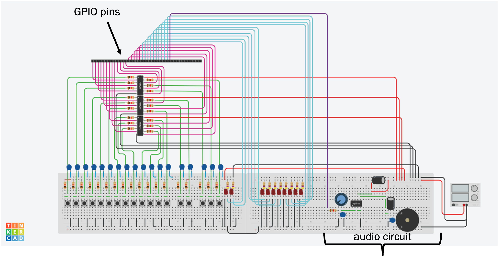
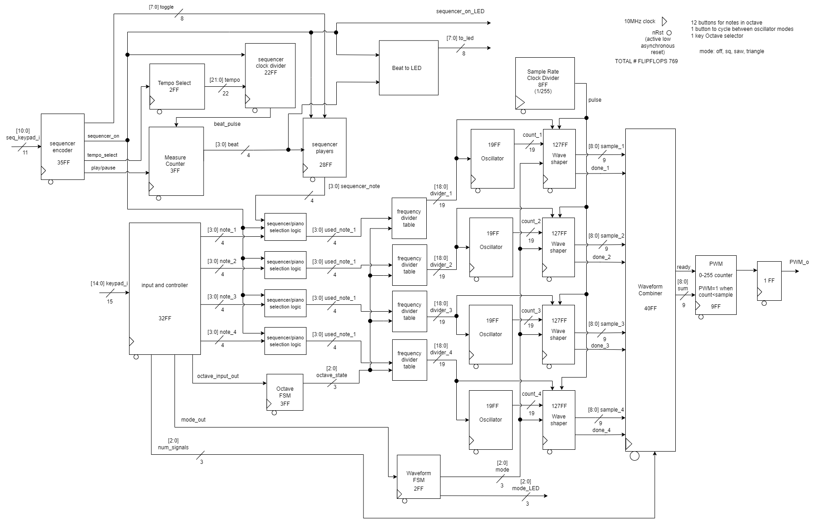

# STARS 2023 Design Final Project

## SaSS: Silicon Allowing Sound Synthesis
* Sydney Cozart
* Elena Lehner
* Connor Mehan
* Alex Rodriguez-Gonzalez​
* TA: Fahad Aloufi

## Synth & Sequencer
This project is an ASIC for a synthesizer that takes in 13 "piano key" inputs and outputs their corresponding sounds. The synthesizer features 3 different waveforms to choose from: square, sawtooth, and triangle. The synthesizer also has an octave mode allowing the user to cycle through 7 possible octaves.

In addition to "piano mode," the ASIC also has a sequencer mode. The sequencer mode has 8 beats whose notes can be edited to form a repeating sound pattern. Within sequencer mode, the tempo can be adjusted between 4 settings.

## Pin Layout
0: C; sequencer note 1

1: C#; sequencer note 2

2: D; sequencer note 3

3: D#; sequencer note 4

4: E; sequencer note 5

5: F; sequencer note 6

6: F#; sequencer note 7

7: G; sequencer note 8

8: G#

9: A

10: A#

11: B

12: C

13: waveform mode

14: octave mode

15: sequencer/piano mode

16: sequencer tempo

17: sequencer play/pause

18: mode LED 1

19: mode LED 2

20: sequencer LED 1

21: sequencer LED 2

22: sequencer LED 3

23: sequencer LED 4

24: sequencer LED 5

25: sequencer LED 6

26: sequencer LED 7

27: sequencer LED 8

28: sequencer on/off LED

29: PWM source

Using the above pin mappings, you can assemble your circuit according to the following circuit diagram. 

You will notice the GPIO header at the top left. With the GPIO header, it is starting from GPIO 0 at the very left. 

## Supporting Equipment
List all the required equipment and upload a breadboard with the equipment set up (recommend using tinkercad circuits if possible)

## RTL Diagrams
Below is a top-level RTL diagram explaining the architecture of our design: 

